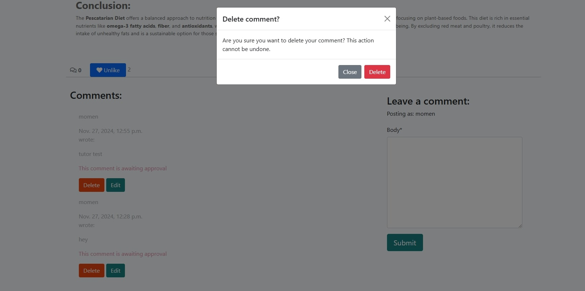
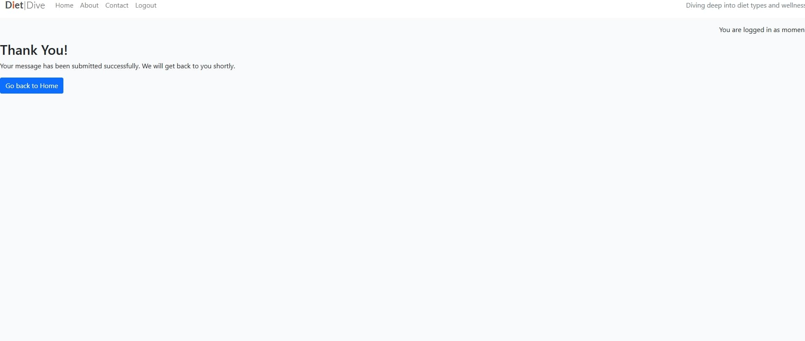

# DietDive

## Welcome ! 
[View the live project here .](https://dietdive-013196ebea26.herokuapp.com/)

[View GitHub repository .](https://github.com/akramalex/DietDive)

## Introduction

DietDive is a project designed to provide users with easy access to valuable information about various diet plans, nutrition, and healthy living. Our platform offers an extensive collection of blog posts that explore popular diets, tips for maintaining a healthy lifestyle, and the latest wellness trends.

Visitors to the website have the opportunity to explore each blog post, accessing detailed information and captivating images of various diet. Additionally, users can initiate contact with DietDive through an integrated contact form, facilitating seamless communication.

Administrators have full CRUD capabilities to manage (add, edit, delete) blog posts on the front-end through the use of a user-friendly and intuitive UI.

To maintain the integrity of the platform, all comments undergo verification and approval by an administrator prior to publication on the website. This ensures that only authenticated and relevant contributions are displayed to the audience.

## UX

  ### The Strategy
  
  #### Site  Aims
  
   Provide Comprehensive Information on Various Diet Plans

  -  To educate users on a wide range of diet plans, including their benefits, challenges, and suitability for different lifestyles.

   -  Help users make informed decisions about diet and wellness by offering detailed, evidence-based content on diets like Mediterranean, Intermittent Fasting, Vegan, DASH, and more.
   User Interaction and Engagement

  -  To allow users to engage with the content through comments and likes, creating a community of people interested in health and wellness.

  -  Enhance user interaction by enabling the comment and like features on blog posts, allowing users to share their thoughts, experiences, and recommendations.
  Facilitate a Personalized Experience

  -  To create a platform that encourages healthy living by promoting knowledge on diets, nutrition, and fitness.

 -  Drive awareness about the importance of a balanced diet, and inspire users to explore different dietary approaches that can contribute to a healthier lifestyle.
Provide a User-Friendly and Accessible Platform

 -  To ensure that users have a seamless, intuitive experience on the website, regardless of their device (mobile, tablet, desktop).

 -  Design DietDive with responsive layouts, clear navigation, and an 
   easy-to-use interface to enhance usability and make content accessible to a diverse audience.

 -  To foster a supportive community of health-conscious individuals who can share experiences, ask questions, and offer support to others on their diet journeys.

 -  Engage users with a space to connect, learn from others, and share 
  advice. DietDive can become a community-driven platform that offers both expert opinions and user-generated content.
  Support Content Creation and Community Contributions

 -  To improve visibility and ranking on search engines like Google.

 -  Implement SEO best practices, ensuring the website is easily discoverable by users searching for diet and wellness content. This includes optimizing blog posts, images, and page titles for SEO.

#### Scope 

 Due to the time and resources available, there will be some trade-offs in terms of features and development efforts. However, I anticipate that some further trade-offs may need to be made in later phases of the project. In order to focus on the MVP (Minimum Viable Product) and launch a basic proof of concept, I have divided the features into three categories to help prioritize and clarify which features are most essential for the initial release.

#### UX Efforts Must Address These:

 1- User Login & Authentication

 * Users must be able to register and log in to the website in order to 
  interact with the content (comment, like.).

 2- Commenting on Posts

 * Users must be able to comment on diet-related blog posts. Comments will be submitted for approval by the administrator before they are made publicly visible.

3- Liking Posts

 * Users must be able to like diet-related blog posts to show their interest. Liking functionality will also be available only for logged-in users.

4- Responsive Design

 * The website must be responsive, ensuring it functions well on both desktop 
  and mobile devices, providing a seamless user experience across different 
   screen sizes.

 5- Diet Information Pages

 * A page dedicated to each diet type (e.g., Mediterranean, Vegan, etc.) with detailed information, images, and health benefits.

6- Admins must be able to manage blog posts (create, edit, delete) and approve comments submitted by users before they are published.

#### UX Efforts Should Accommodate These:

1- Post Excerpts on Homepage

* Display short excerpts of blog posts with a  link on the homepage and category pages.

2- Contact Form

* Include a simple form for users to reach out to the administrators with inquiries or comments.

3- Basic Analytics for Admin

* Track key metrics such as the number of likes and comments on each post to provide admins with insights on content performance.

#### Unwise Use of Time to Address There:

1- User-Generated Content (Posts)

* Allowing users to create and submit their own blog posts is not a priority for the MVP and will be postponed for future phases.

2- Advanced User Analytics

* Tracking detailed user behavior, such as which posts users spend the most time reading or interacting with, should be deprioritized.

3- Advanced Search & Filters

for user search filters (e.g., based on health benefits, calorie count, etc.) are not critical at this stage.

4- Complex Community Features

* Features such as discussion boards or community chat should be postponed to future phases. For now, commenting and liking are sufficient for user interaction.

5- Interactive Diet Tools

* Tools like calorie calculators, diet planners, or interactive charts should be avoided in the MVP, as they would require significant development time and resources.

### Structure

To help me visualize a typical user journey around the site, I used [lucid.app](https://lucid.app/) to help me plan out the various routes.

#### User Stories :

 - As an Admin i can..

   *  view comments on an individual post so that I can read the conversation.

   * create, read, update and delete posts so that I can manage my blog content.

   * create draft posts so that I can finish writing the content later.

   * approve or disapprove comments so that I can filter out objectionable comments.

   * create or update the about page content so that it is available on the site.

   * view all contact submissions so that I can respond to inquiries or feedback.

 - As a Site User I can...

   *  view a paginated list of posts so that I can I can select which post I want to view.
   
   * click on a post so that I can read the full text.

   *  view comments on an individual post so that I can read the conversation.

   * register an account so that I can comment on a post.

   * leave comments on a post so that I can be involved in the conversation.

   *  modify or delete my comment on a post so that I can be involved in the conversation.

   *  like a post so that I can show my appreciation for the content.

   *  unlike a post that I previously liked so that I can change my preference.

   * click on the About link so that I can read about the site.

   * use the Contact Us form so that I can reach out with questions or feedback.

###### Acceptance Criteria
   

###  Skeleton

  #### Wireframes:
  The appearance of each page of the website was planned by making wireframes. It was essential to provide a positive user experience for the user.

Initially, wireframes plans were hand-drawn on a notepad. More detailed wireframes were then created using a desktop version of [Balsamiq](https://balsamiq.cloud/). 
They can be found below:
 - home page

- about 

- contact 

- small screen

###  Database Design

Entity Relationship Diagrams (ERD) help to visualize database architecture before creating models. Understanding the relationships between different tables can save time later in the project.
To follow best practice, a database schema was created for the backend DB and tables, and mapped out before coding began using a free version of [Lucidchart](https://lucid.app/) .

Below is the database structure:

#### Surface

#### Color Scheme: 

I used the following Image to generate the following color scheme on [coolers](https://coolors.co/).co. The resultant color scheme was:

##### Typography:

 * Lato:

     Used for: The brand name in the navbar and text in the hero section for a clean, modern look.
.

* Roboto:

     Used for: Body text and general content to provide readability and clarity.

## Features

The following features have been implemented:

* Fully responsive website consisting of:
* Home (the blog)
* About
* Contact
* Login
* Logout
* Register
* Blog Detail - with CRUD functionality for logged in users to like a post and/or comment on a post (comments can be edited or deleted)

* Blog Admin - with CRUD functionality for logged in superadministrators

### Site Navigation

### Navbar

* Featured at the top of the page, the navigation shows the DietDive the left corner. For smaller devices. 

* The other navigation links are: Home, About, Contact , Register,  and LogiLogout which link to different pages of the site.

* The active page which the user is currently on is underlinedH.

* When the user hovers over a link, the link is in bold.

* The navigation makes clear the name of the company and website.

* The navigation makes the different sections of information easy to find.

* On smaller devices the navigation converts to a burger menu

### Homepage

* The homepage consists of a large hero image. Here the user is welcomed to the blog and provided a short blub about the site.

* The 'learn about Diet Dive and our mission' button takes the user to the 'About' page.

* below the hero section is all of the blog posts. The posts are displayed in 3 columns, with 6 posts per page.

* Each post is in a bootstrap card, with the post's: dietname, title, author, excerpt, date created and feature image.

* On smaller devices the layout changes to one column per post to maximise usable screen space.

* The next button takes the user to the next 6 blog posts (pagination)

* The user can click on the blog post's title/excerpt/image to take them to that post's post detail page. Here they can view the whole post.

       

### Blog

* Each blog post can be clicked - bringing the user to the blog details page for that post.

* The header section contains the blog title, feature image, author and date the post was created.

* The blog post is rendered to the page for the user to read.

* Below the post is a like button and a comment sections. These features are read-only for non-logged in users. Logged in users can like or comment on the post.

* For non-logged-in users, a login button is provided with a link that directs them to the sign-in/sign-up page, allowing them to comment and like posts once they are authenticated.

* Clicking the heart icon likes the post. Users can click on the heart again to unlike the post.

* The number of likes and comments for that particular blog post is clearly visible.

* Logged in users can write a comment using the comment form and submit it to the DB. It must be approved by an administrator in order to appear on the front end.

* A logged in user can edit or delete their own comment. Editing a comment will resubmit the new comment to the DB for approval.

### About page 

* The About page is a simple page to inform site users all about DietDive.

* It consists of about content, an image, and the date edited (from the about DB table).

* The contents of the about page can be edited with a UI from the admin area.

### Contact Page

* The Contact page consists of a form a user can use to get in touch with DietDive.

* Front end validation code ensures users must fill out all fields in order to submit the contact form.

* Once the user submits a message, they are shown a confirmation message stating: 'Thank you! Your message has been submitted successfully. We will get back to you shortly.' Below the message, a button is provided to redirect users back to the homepage.

* I also ensured that any required elements removed from the front-end trigger an error message stating, "there was an error . Please try again."

### login, logout, register 

* Users can register for an account by filling out the registration form.

* This form is validated on the front end so that users must submit required 
  information.

* Passwords rules apply:
  - Your password can’t be too similar to your other personal information.
  - Your password must contain at least 8 characters.
  - Your password can’t be a commonly used password.
  - Your password can’t be entirely numeric.
  - The password must be entered twice and the 2 passwords must match.

* Clicking the sign up button will create a new user and the user can then sign in and use the user functionality on the website.

* Users can login from the login page. They must enter the correct username and password.

* User can easily log out by clicking the logout button in the navigation bar.

### Footer
* The footer is simple with a navigation menu and social links.

## Future Features/Improvements

 * User Profile

   - Ability to post blogs.
   - Option to save blogs to a favorites list.
   - Ability to update profile image.

* sign up 

  - Email verification upon registration for security.
  
  - Account verification for added user authentication.

## Agile Development Process

[GitHub Projects](https://github.com/users/akramalex/projects/11) served as an 
Agile tool for this project.

 - The dietDive project was managed from the beginning using GitHub Projects (View Project Here), in order to ensure an agile approach.

 - The project goals were broken into Epics, each further divided into User Stories.
 
 
 

 ### MoSCoW Prioritisation
I've decomposed my Epics into stories prior to prioritizing and implementing them. Using this approach, I was able to apply the MoSCow prioritization and labels to my user stories within the Issues tab.

 * Must Have: guaranteed to be delivered

 * Should Have: adds significant value, but not vital

 * Could Have: has small impact if left out

 

## Technologies used

* Python

   - he packages installed for the is project can be found in the [requirements.txt](https://github.com/akramalex/DietDive/blob/main/requirements.txt)
* Django
  - Django was used as the python framework in the project.
  - Django all auth was used to handle user authentication and related tasks i.e. sign in, sign up, sign out.

* Heroku
  - Used to deploy the page and make it publicly available.

* [dbs](https://dbs.ci-dbs.net/)
   - Used for the database during development and in deployment.

* HTML
  - HTML was the base language used to layout the skeleton of all templates.
* CSS
 - Custom CSS used to style the page and make the appearance look a little 
  more unique.

* Javascript
  - I have used Javascript throughout to handle comments , edit and delete 

* Bootstrap 5.1.3
  - Used to style HTML, CSS, minor javascript. The more I used this framework the most I realized retrospectively how it could have saved me writing several parts of the code I had already written.

* Font awesome
  - All icons throughout the page.

* favicon

   - The favicon is used to enhance the branding and user experience by providing a recognizable icon in the browser tab, making it easier for users to identify the website when multiple tabs are open.

## Testing 

I have included testing details during and post-development in a separate document called [TESTING.md](https://github.com/akramalex/DietDive/blob/main/TESTING.md).

## Deployment 

The live deployed application can be found deployed on [Heroku](https://id.heroku.com/login).

 ### dbs Database

This project uses [dbs](https://dbs.ci-dbs.net/)  for the PostgreSQL Database.

1: Provide  Email Address#
2: Create  PostgreSQL Database

3: Get the Database URL

### Cloudinary API
This project uses the [Cloudinary API](https://console.cloudinary.com/settings/c-54e56b1299a77e8b55f6dcb16bacf1/api-keys) to store media assets online, due to the fact that Heroku doesn't persist this type of data.

To obtain your own Cloudinary API key, create an account and log in.

  - For Primary interest, you can choose Programmable Media for image and video API.
 - -Optional: edit your assigned cloud name to something more memorable.
 - On your Cloudinary Dashboard, you can copy your API Environment Variable.
 - Be sure to remove the CLOUDINARY_URL= as part of the API value; this is the key.

 ###  Heroku Deployment

This project uses [Heroku](https://id.heroku.com/login)
, a platform as a service (PaaS) that enables developers to build, run, and operate applications entirely in the cloud.

Deployment steps are as follows, after account setup:

 * Select New in the top-right corner of your Heroku Dashboard, and select Create new app from the dropdown menu.
* Your app name must be unique, and then choose a region closest to you (EU or USA), and finally, select Create App.
* From the new app Settings, click Reveal Config Vars, and set your environment variables.

Heroku needs two additional files in order to deploy properly.

* requirements.txt
* Procfile

You can install this project's requirements (where applicable) using:

 * pip3 install -r requirements.txt
 If you have your own packages that have been installed, then the requirements file needs updated using:

 * pip3 freeze --local > requirements.txt
The Procfile can be created with the following command:

 * echo web: gunicorn app_name.wsgi > Procfile
 * replace app_name with the name of your primary Django app name; the folder where settings.py is located

For Heroku deployment, follow these steps to connect your own GitHub repository to the newly created app:

Either:

 * Select Automatic Deployment from the Heroku app.
Or:

 * In the Terminal/CLI, connect to Heroku using this command: heroku login -i
 * Set the remote for Heroku: heroku git:remote -a app_name (replace app_name with your app name)
* After performing the standard Git add, commit, and push to GitHub, you can now type:
    - git push heroku main
    
The project should now be connected and deployed to Heroku!

### Local Deployment 

This project can be cloned or forked in order to make a local copy on your own system.

For either method, you will need to install any applicable packages found within the requirements.txt file.

You will need to create a new file called env.py at the root-level, and include the same environment variables listed above from the Heroku deployment steps.

Sample env.py file:

import os

os.environ.setdefault(
    "DATABASE_URL", "postgres://##)
os.environ.setdefault("SECRET_KEY", "##")

os.environ.setdefault(
    "CLOUDINARY_URL", "cloudinary://##")

    
 local environment only (do not include these in production/deployment!)
Setting.py("DEBUG", "True")

Once the project is cloned or forked, in order to run it locally, you'll need to follow these steps: 

- Start the Django app: python3 manage.py runserver
- Stop the app once it's loaded: CTRL+C or ⌘+C (Mac)
- Make any necessary migrations: python3 manage.py makemigrations
- Migrate the data to the database: python3 manage.py migrate
- Create a superuser: python3 manage.py createsuperuser
- Load fixtures (if applicable): python3 manage.py loaddata file-name.json (repeat for each file)
- Everything should be ready now, so run the Django app again: python3 manage.py runserver

### Cloning on a Local machine or Via Gitpod Terminal

*  Navigate to the [GitHub repository](https://github.com/akramalex/DietDive)

 

* Open Gitpod
 
    In the GitHub repository, click on the green Gitpod button, or use the following link to open the repository in Gitpod directly:

https://gitpod.io/#https://github.com/akramalex/DietDive

* Set Up the Gitpod Workspace

  Gitpod will automatically set up a workspace for you, which includes cloning the repository and installing the necessary dependencies.

* Install Required Dependencies
  In Gitpod, open the terminal and run the following command to install the required Python dependencies:

pip install -r requirements.txt

* Configure the Database
  -  In Gitpod, you can either connect to a local database or use an external PostgreSQL database. Follow the provided instructions to configure the database.

* Run Migrations
  - After setting up the database, run the following command to apply the database migrations and create the necessary tables:

    python manage.py migrate
* Run the Development Server
  - You can now run the Django development server in Gitpod by executing the following command:

python manage.py runserver
Access the Application
Gitpod will provide a publicly accessible URL to view your application in the cloud. After starting the server, the URL will look like this:
[DietDive](https://8000-akramalex-dietdive-9xwmeslqna3.ws.codeinstitute-ide.net)

  ## Credits

   - [Balsamiq](https://balsamiq.cloud/) was used to create the wireframes.
   - The site was developed using [Gitpod](https://codeinstitute-ide.net/).
   - [GitHub](https://github.com/) was used to store my repository.
   - Responsive screenshot made using [Amiresponsive](https://amiresponsive.co.uk/)
   - Database used [dbs](https://dbs.ci-dbs.net/)

  - [coolers.co](https://coolors.co/603f3f-a0acca-e4b67c-de9f13-000000) was used 
  to generate color scheme.
  - [W3cschool](https://www.w3schools.com/) was used to source the majority of the code used to create a timeline in CSS for the insights page. Minor styling adjustments were made and the HTML was adapted to include a Jinja for loop to display the relevant data without code repetition.
  - [lucid.app](https://lucid.app/) was used to create Database Schema

 - Fonts were taken from [Google Fonts](https://fonts.google.com/)

 - [favicon.io](https://favicon.io/) was used to create favicon

 - Bootstrap was used to enhance the styling and provide responsive, mobile-first design with pre-built CSS components.

  ### Content
  
  * The information regarding diets has been sourced from [Prevention.com](https://www.prevention.com/)

### Media

* The image in the header was taken from [ Pexels ](https://www.pexels.com/)

