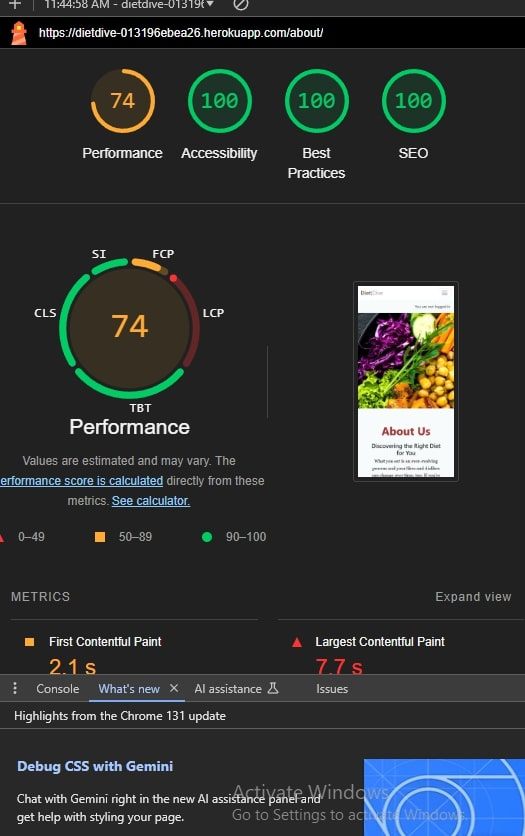

# Testing

Return back to the [README.md](https://github.com/akramalex/DietDive/blob/main/README.md) file.

* I tested that this page works in different browsers: Chrome, Firefox, Safari, Internet Explorer.

* I confirmed that this project is responsive, looks good, and functions on all standard screen sizes using devtools and the device toolbar.

* I confirmed that the navigation header, "About Us," "Sign Up," and "Contact" text are all readable and easy to understand.

* I have confirmed that the form works, requires entries in every field, and will only accept an email in the email field.

## Code Validation 

### HTML 

I have used the recommended HTML [W3C Validator](https://validator.w3.org/) to validate all of my HTML files.

* Home 

* About
  

* Contact

* Login 

* Logout 

* Regster

* Post

* Post like/comment 

### CSS  

I have used the recommended [CSS Jigsaw Validator](https://jigsaw.w3.org/css-validator/) to validate all of my CSS files.

### JavaScript 

I have used the recommended [JShint Validator](https://jshint.com/) to validate all of my JS files.

### Python  

I have used the recommended [PEP8 CI Python Linter](https://pep8ci.herokuapp.com/#) to validate all of my Python files.

####  manage.py 

#### settings.py 

#### Blog

 * admin.py 

 

 * apps.py

* forms.py

* models.py 

* url.py

* view.py

#### About
 

 * admin.py 

 

 * apps.py

* models.py 

* url.py

* view.py

#### Contact
 

 * admin.py 

 

 * apps.py

* models.py 

* url.py

* view.py

 

 ### lighthouse 

  * Home 

  

* About

* Contact

* Register 

* Sign in 

* Mobile  light house 

   - Home 

  

   -  About

   

   -  Contact

   

  -  Register 

  

  -  Sign in 

  

## Manual Test 

all user stories is with acceptance criteria has been run into manual test 

1. View paginated list of posts
     - Acceptance Criteria:
        * Given more than one post in the database, these multiple posts are listed.
       * When a user opens the main page a list of posts is seen.

       * Then the user sees all post titles with pagination to choose what to read.

2. Open a post
    - Acceptance Criteria: 
      * When a blog post title is clicked on a detailed view of the post is seen.

3. View comments
    - Acceptance Criteria:
      * Given one or more user comments the admin can view them.
      * Then a site user can click on the comment thread to read the conversation.

4. Account registration

   - Acceptance Criteria: 

     * Given an email a user can register an account.
     * Then the user can log in.
     * When the user is logged in they can comment.

5. Comment on a post

   - Acceptance Criteria: 
      * When a user comment is approved.
      * Then a user can reply.
      * Given more than one comment then there is a conversation thread.

6. Modify or delete comment on a post

   - Acceptance Criteria:
     * Given a logged in user, they can modify their comment.
     * Given a logged in user, they can delete their comment.
7. Like a post

   - Acceptance Criteria:
     
     *  When a user clicks the "like" button, the post's like count is updated.
     * Then the like button is disabled to prevent multiple likes from the same user.
     * The number of likes is visible to all users viewing the post.
8. Unlike a post
    - Acceptance Criteria: 
        * Given that the user has already liked a post, they can click an "unlike" button.
        * When the user unlikes the post, the like count is updated and the like button is re-enabled.
        * The updated number of likes is visible to all users.
9. Manage posts
   - Acceptance Criteria:
      * Given a logged in user, they can create a blog post.
      * Given a logged in user, they can read a blog post.
      * Given a logged in user, they can update a blog post.
      * Given a logged in user, they can delete a blog post.
10. Create drafts
     - Acceptance Criteria:
        * Given a logged in user, they can save a draft blog post.
        * Then they can finish the content at a later time.
11. Approve comments
    - Acceptance Criteria:
      * Given a logged in user, they can approve a comment.
      * Given a logged in user, they can disapprove a comment.
12. Read about the site
     - Acceptance Criteria: 
       * When the About link is clicked, the about text is visible.
13. Add and update the about text
    - Acceptance Criteria:
      * The About app is visible in the admin panel

14. Contact the Site
    - Acceptance Criteria:
      * When the Contact Us link is clicked, the Contact Us form is visible.
      * When the form is submitted, a confirmation message is displayed to the user.

15. View Contact Submissions

    - Acceptance Criteria:

      * Given one or more contact form submissions, they are listed in the admin panel.
      * The admin can access each submission’s details to review messages individually.

 

 # bug

##  Unresolved bugs

 There are no other unresolved bugs that I am aware of.

 ### Fixed Bugs

 * After deploying on Heroku, the CSS was not working properly. This issue was resolved by running the collectstatic command.

 * The JavaScript for the comment functionality was working fine on the live app but not in the local terminal. The issue was caused because I updated the JavaScript file in the staticfiles folder instead of the static folder. This was fixed by updating the JavaScript file in the correct static folder.

 Return back to the [README.md](https://github.com/akramalex/DietDive/blob/main/README.md) file.